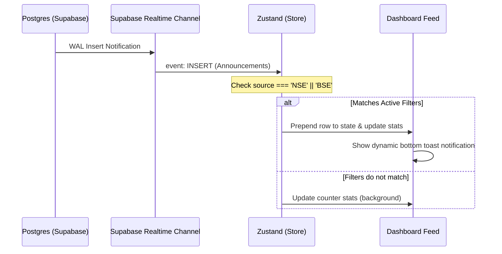

# Corporate News Dashboard (NSE & BSE)

A modern, high-performance real-time web application built with React, TypeScript, and Tailwind CSS. The dashboard connects to Supabase and streams official corporate announcements filed on the National Stock Exchange (NSE) and Bombay Stock Exchange (BSE).

## Features

- **Obsidian Glassmorphic UI**: Sleek dark mode visual layout utilizing Google Font `Outfit`, pulsing glow cues, custom scrollbars, and micro-interactions.
- **Server-Side Pagination & Querying**: Designed to seamlessly load and filter **100,000+ announcements** without client lag using Supabase range limits.
- **Custom-Built Virtualized List**: Extremely lightweight virtualization render cycle that handles large data feed heights without memory leaks.
- **Supabase Realtime Stream**: Listens to SQL `INSERT` events, filters out third-party logs, updates stats widgets, and triggers interactive toast notification triggers.
- **Statistics Counter Cards**: Database-wide aggregated totals for NSE, BSE, and today's news volume.
- **Dynamic Tag Filter**: Multi-select tags (e.g. Board Meetings, Dividends, Financial Results) alongside text match search inputs.

---

## Supabase Database Schema

The dashboard connects to an existing table named **`corporate_announcements`**. The table must match the following columns:

| Column Name | Data Type | Description |
| :--- | :--- | :--- |
| **`source`** | `text` or `varchar` | Must be either `'NSE'` or `'BSE'` (other entries are filtered out) |
| **`headline`** | `text` | The official corporate announcement headline |
| **`article_cleaned`** | `text` | Cleaned textual description or extract of the event filing |
| **`url`** | `text` | URL linking to the original exchange PDF filing |
| **`tags`** | `text[]` (or comma-separated `text`) | Event tags (e.g. Dividend, Board Meeting, Results) |
| **`published_at`** | `timestamptz` or `timestamp` | Datetime timestamp when the corporate filing was published |

---

## Getting Started

### 1. Installation

Clone the repository and install the dependencies:

```bash
npm install
```

### 2. Configure Environment Variables

Create a copy of `.env.example` named `.env` in the root folder:

```bash
cp .env.example .env
```

Open `.env` and fill in your Supabase connection parameters:

```env
VITE_SUPABASE_URL=https://your-supabase-project.supabase.co
VITE_SUPABASE_ANON_KEY=your-anon-public-api-key
```

### 3. Local Development

Run the development server locally:

```bash
npm run dev
```

The application will launch and compile on [http://localhost:5173/](http://localhost:5173/).

---

## Render Deployment

This project is pre-configured for static host deployment on **Render** via [render.yaml](file:///Users/bxnkar/NEWS_FINAL/BSE_NSE-dashboard/render.yaml).

### Steps to Deploy:

1. Push this repository to your GitHub/GitLab account.
2. Log into the [Render Dashboard](https://dashboard.render.com/).
3. Click **New +** and select **Blueprint**.
4. Connect your repository. Render will automatically parse the `render.yaml` specification.
5. Provide values for the required environment variables:
   - `VITE_SUPABASE_URL`
   - `VITE_SUPABASE_ANON_KEY`
6. Click **Deploy**. Render will build and host the static files under the `dist` directory.

---

## Realtime Architecture



---

## Troubleshooting

### Realtime status stays stuck on "Connecting..."
- Ensure your Supabase client configuration in `src/lib/supabase.ts` is correct.
- Verify that **Realtime** is enabled on the `corporate_announcements` table in your Supabase database console under Database > Replication > Source.

### Database query errors or blank tables
- Check your browser developer tools console for Postgres schema errors.
- Ensure that columns in the `corporate_announcements` table match the exact casing and type requirements specified in the Schema section.
